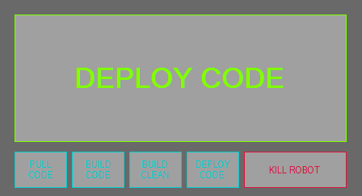

#Simple Deploy Utility

---

> Remembering commands is hard, pushing giant buttons is easier.

##Features:
- A kitchen sink mode, wherein a project will be downloaded, built , and deployed.
- Every afformentioned step as a substep.
- Run time configuration.

##Why would I use this?
- The command line scares normal people sometimes, buttons are friendly
- You want a base program written in Visual Basic to hack on
